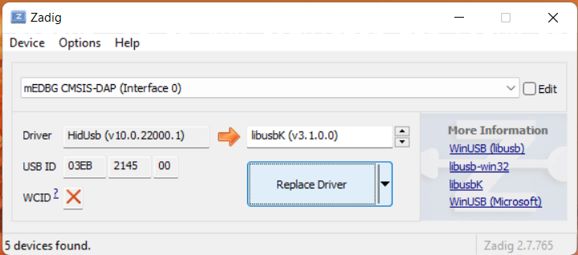
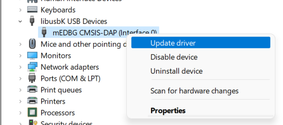
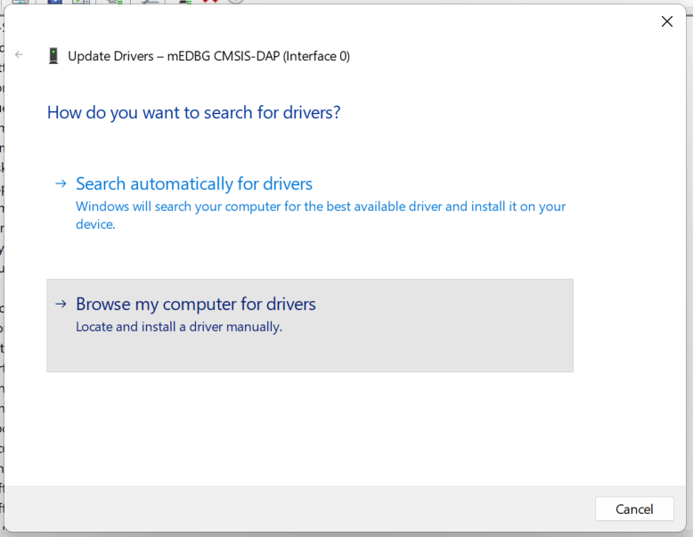
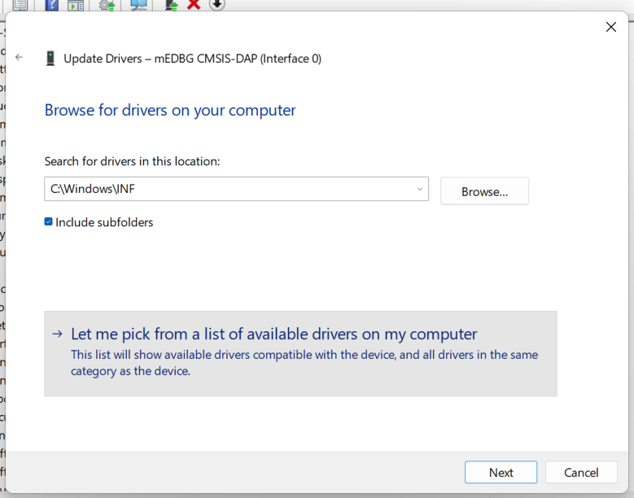
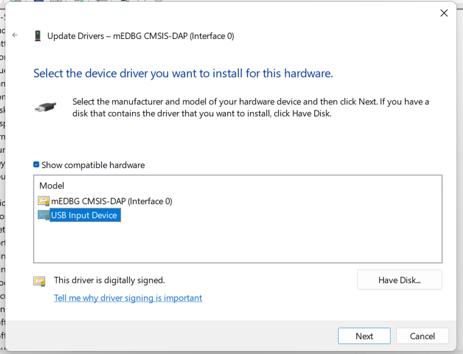

# EE209 PlatformIO

Simple example of using PlatformIO for AVR projects.

## Troubleshooting

### Windows

> 💡 Are you getting the following error when trying to upload?
> ```diff
> avrdude: jtag3_open_common(): Did not find any device matching VID 0x03eb and PID list: 0x2145
> 
> avrdude done. Thank you.
>
> *** [upload] Error 1
> ```
>
> If so, keep reading!

By default, Microchip Studio installs `HID Input Device` drivers for the Xplained Mini.

These drivers are incompatible with `avrdude` (used by PlatformIO), which uses `libusb` to communicate with the Xplained Mini instead.

This guide details the process of using [Zadig](http://zadig.akeo.ie/) to replace the HID drivers.

> **Warning**  
> This process will result in Microchip Studio **no longer recognising the Xplained Mini as a connected device**, as we have replaced its Xplained Mini drivers.
>
> To revert these changes and restore Microchip Studio functionality, follow the steps detailed in [**Reverting Driver Changes**](#reverting-driver-changes).

1. Install [Zadig](http://zadig.akeo.ie/)

2. Click `Options` > `List All Devices`

3. Select `mEDBG CMSIS-DAP (Interface 0)`

4. Change the driver to `libusbK` or `libusb-win32`

5. Click `Replace Driver`

6. Try to upload with PlatformIO again



#### Reverting Driver Changes

To restore the original `HID Input Device` driver, follow the below steps.

1. Open `Device Manager` (`Win` + `x` > `m`)

2. Expand `libusbK USB Devices`
	> 

3. Right click `mEDGB CMSIS-DAP (Interface 0)`

4. Click `Update driver`

5. Click `Browse my computer for drivers`
	> 

6. Search for drivers under `C:\Windows\INF` (including subfolders)
	> 

7. Click `Let me pick from a list of available drivers on my computer`

8. Click `USB Input Device`
	> 
	 
	> **Note**  
	> Select `mEDBG CMSIS-DAP (Interface 0)` here to re-configure the drivers for PlatformIO.

9.  Click `Next`

The Xplained Mini should then appear in Microchip Studio, and can be programmed as usual.
